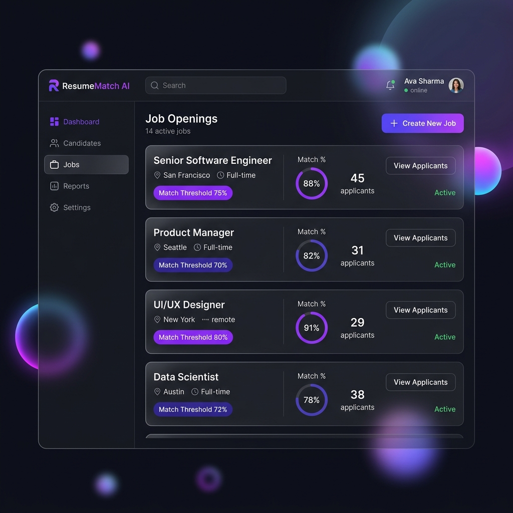
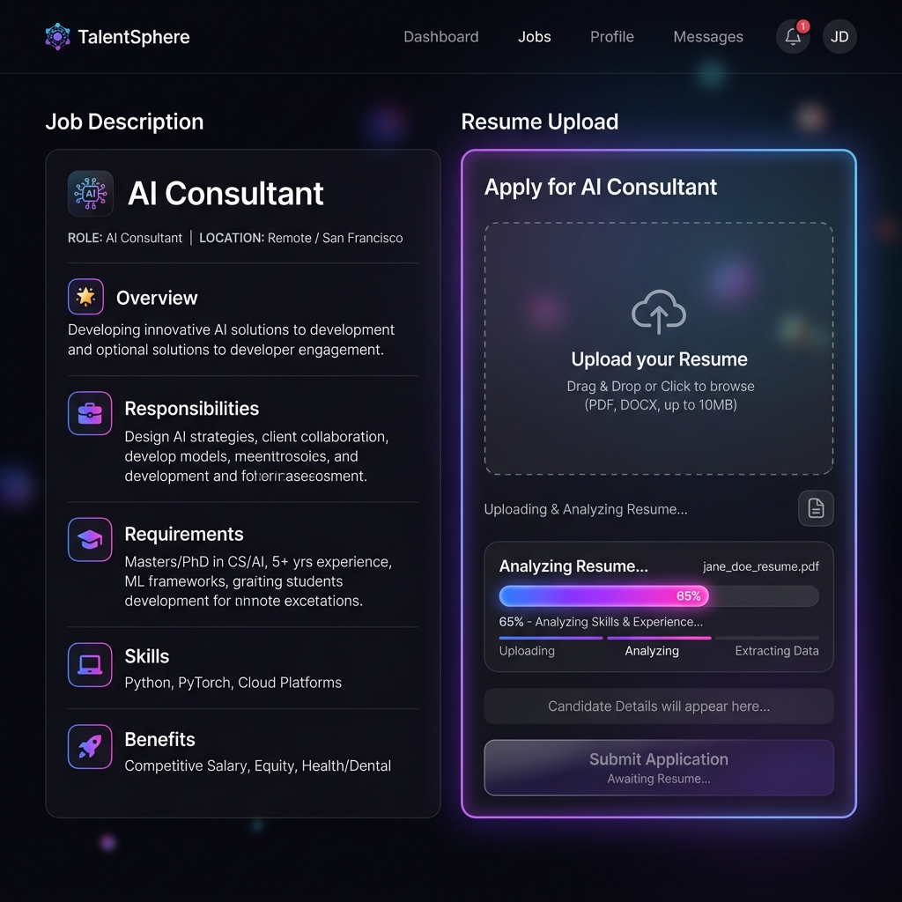
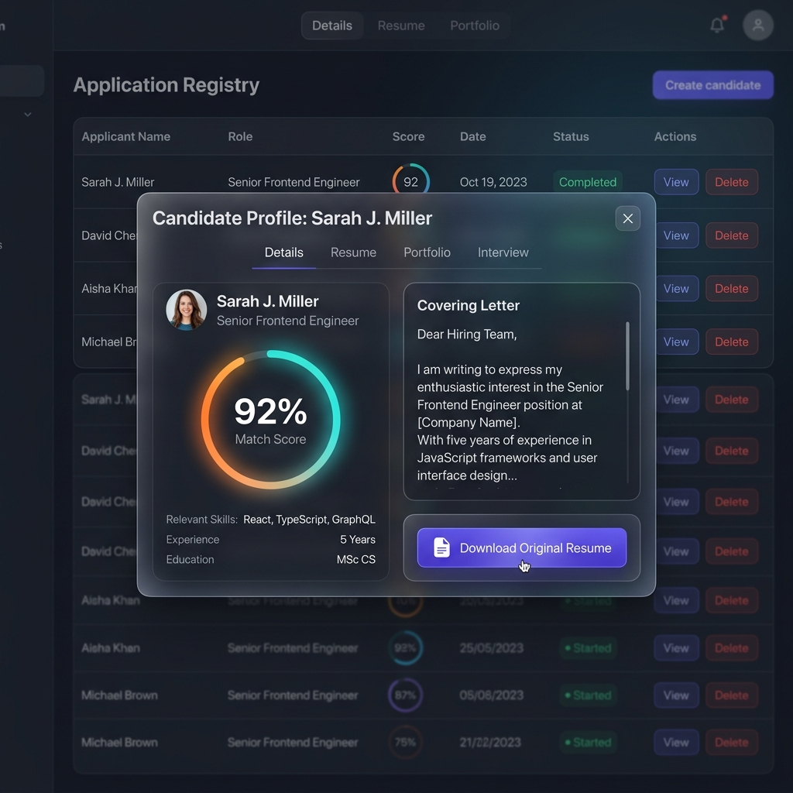

# ResumeMatch AI 🚀

**The Recruiter's Edge:** What happens when you make job posting on LinkedIn. You close comments to avoid comments similar to "I am interested" or "I want to apply". That's just the tip of the iceberg. When you post job requirements, you often get hundreds of resumes that must be screened manually, a time-consuming and exhausting process. Most candidates don't match the job description. That's where ResumeMatch AI comes in.

**ResumeMatch AI** is a premium, privacy-first resume screening platform. It empowers recruiters with a stunning glassmorphic dashboard to manage jobs and distribute secure "Magic Link" portals to candidates. The "Magic link" is posted on your job listing where candidates can click to open up ResumeMatch AI portal to apply. Once the candidate clicks on the link, the platform uses a hybrid AI engine (Local OCR + DeepSeek-V3) to instantly extract skills, match them against the Job Description, and determine if they pass the threshold. It also strictly protects candidate privacy through local PII redaction.


_Modern Recruiter Dashboard with Job Management_


_AI-Powered Candidate Portal with Instant Analysis_


_Application Registry with Detailed Match Insights_

## 🌟 Key Features

- **Privacy-First AI Matching:** Uses **DeepSeek-V3** (via DeepInfra) for intelligent, context-aware matching. **Crucially**, all PII (Name, Email, Phone, Social Links) is redacted locally _before_ being sent to the AI, ensuring personal data never leaves your server.
- **Smart Pre-filling:** Automatically extracts candidate details and portfolio links (GitHub, LinkedIn, Behance) from PDFs (including "hidden" icon links) to pre-fill the application form.
- **Dual-Role Workflow:**
  - **Admin Dashboard:** Full CRUD for Jobs, passing thresholds, and Magic Link generation.
  - **Candidate Portal:** A beautiful 2-column interface showing the Job Description alongside a seamless upload and analysis flow.
- **Application Registry:** A sophisticated historical record of all processed resumes.
  - **Detail Modal:** Review candidate scores, covering letters, and parsed content in a single view.
  - **Document Storage:** Securely stores and serves the original uploaded resume for recruiter review.
- **Cloud-Ready & Scalable:** Native support for **Neon PostgreSQL** and **Blaxel.ai** deployment.
- **Premium Design:** State-of-the-art glassmorphism UI built with React, Vite, Tailwind CSS, and Framer Motion.

---

## 🛠️ Architecture

1.  **Resume CLI (Rust):** Fast SQLite schema management (`resume_cli`).
2.  **Backend API (FastAPI):** Handles redaction, DeepSeek-V3 integration, document storage, and secure routing.
3.  **Frontend Web App (React):** Premium SPA for Admin Dashboards and Candidate Portals.

---

## 📦 Installation

### Prerequisites

- Python 3.10+, Node.js 18+, Rust
- Tesseract OCR & Poppler (for PDF parsing)
- A [Blaxel.ai](https://blaxel.ai) account (for backend hosting)
- A [Vercel](https://vercel.com) account (for frontend hosting)
- A [DeepInfra](https://deepinfra.com) account (for AI inference)
- A [Neon](https://neon.tech) PostgreSQL database (or local SQLite)

### 1. Clone & Install

```bash
git clone https://github.com/vinodvv2023/ResumeMatchAI.git
cd ResumeMatchAI

pip install -r backend/requirements.txt
cd frontend && npm install && cd ..
```

### 2. Environment Configuration

Copy `.env.example` to `.env` and fill in the values:

```bash
cp .env.example .env
```

#### Backend (`.env` or `.env.prod` for Blaxel deployment)

| Variable | Required | Description |
|---|---|---|
| `JWT_SECRET_KEY` | Yes | Long random string for signing JWT tokens. **Must match the value set in Vercel.** |
| `JWT_EXPIRE_MINUTES` | No | Token expiry in minutes (default: `1440` = 24h) |
| `DATABASE_URL` | No | PostgreSQL connection string (falls back to local SQLite) |
| `FRONTEND_URL` | No | Your Vercel frontend URL (e.g. `https://your-app.vercel.app`) |
| `DEEPINFRA_API_TOKEN` | Yes | DeepInfra API token for AI-powered resume matching |
| `AGENT_DEEPINFRA_MODEL` | No | Model to use (default: `deepseek-ai/DeepSeek-V3`) |

#### Vercel Frontend (set in Vercel Dashboard → Settings → Environment Variables)

| Variable | Required | Description |
|---|---|---|
| `VITE_API_URL` | Yes | Your Blaxel backend URL (e.g. `https://sbx-yourapp.region.bl.run`) |
| `VITE_BLAXEL_API_KEY` | Yes | Blaxel API key (used by the proxy to authenticate with Blaxel) |
| `VITE_BLAXEL_WORKSPACE` | Yes | Blaxel workspace name (used by the proxy for routing) |
| `JWT_SECRET_KEY` | Yes | **Must match the backend's `JWT_SECRET_KEY` exactly** |
| `FRONTEND_URL` | No | Your Vercel frontend URL |

> **Important:** `VITE_BLAXEL_API_KEY` and `VITE_BLAXEL_WORKSPACE` are required for the Vercel proxy (`frontend/api/[...path].ts`) to authenticate with Blaxel's routing layer. Without them, API requests will be rejected with 401 by Blaxel.

### 3. Database Setup

- **Local SQLite:** Run `cd resume_cli && cargo run -- init`.
- **Neon PostgreSQL:** Update `DATABASE_URL` in `.env` and run migrations from `docs/migrations/`.

### 4. Local Development

```bash
# Terminal 1 — Backend
cd backend && uvicorn backend.main:app --reload --port 8000

# Terminal 2 — Frontend
cd frontend && npm run dev
```

### 5. Production Deployment

#### Deploy Backend (Blaxel)

```bash
# Create .env.prod with backend variables, then:
bl deploy --env-file .env.prod
```

#### Deploy Frontend (Vercel)

1. Push to GitHub and connect the repo to Vercel.
2. Set the **Root Directory** to `frontend/` in Vercel project settings.
3. Add all Vercel environment variables listed above (Production + Preview + Development).
4. Deploy.

> **Architecture Note:** The Vercel proxy (`frontend/api/[...path].ts`) forwards browser requests to the Blaxel backend. It strips the `authorization` header (to avoid Blaxel intercepting the JWT) and re-sends it as `x-forwarded-authorization`. The FastAPI backend reads this header for token verification.

---

## 📖 Complete Workflow

1.  **Job Creation:** Recruiter sets a job with a 65% threshold.
2.  **Magic Link:** Candidate receives a unique URL.
3.  **Analysis:** Candidate uploads a resume. The system:
    - Extracts text and links locally.
    - **Redacts** Name/Email/Phone from the text.
    - Sends **Anonymized** text to DeepSeek-V3 for scoring.
4.  **Pre-fill:** The candidate sees their match score. The form is auto-filled with their (locally stored) contact info and portfolio links.
5.  **Submission:** Candidate adds an optional **Covering Letter** and submits.
6.  **Review:** Recruiter uses the **Registry** to view the application, read the covering letter, and download the original resume.

---

## 📝 License

Released under Apache License 2.0. Modify and distribute as needed.
